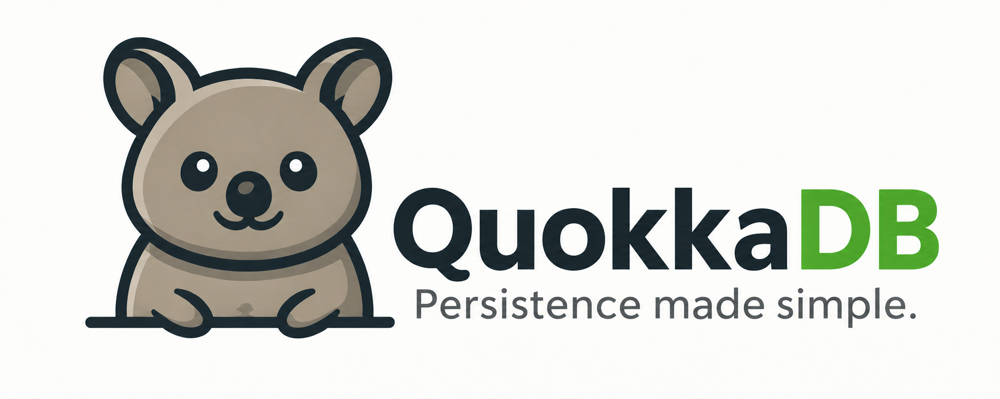

<p style="text-align: left;">
  
</p>

# QuokkaDB

**The embedded application database.**

QuokkaDB makes application persistence simple. Store and query your application's models and state without running database infrastructure.

## Persist your models, not your mappings

Applications are built from nested objects, collections, and evolving state. **QuokkaDB stores that structure directly**, without decomposing your models into tables, joins, and mapping layers.

## Persistence without infrastructure

- **No server** — QuokkaDB runs inside your application.
- **Single directory** — all database files live in one place.
- **No setup** — open a path and start storing data.
- **Flexible schema** — evolve your documents with your application models.
- **No ORM** — persist nested application models directly.
- **Small and bounded** — designed for predictable application-level resource usage.
- **Real database semantics** — durability, indexes, concurrent access, atomic updates, and crash recovery.

QuokkaDB is designed to make persistence a boring part of building an application.

## Quick start

Add QuokkaDB and the dependencies used by the examples to your `Cargo.toml`:

```toml
[dependencies]
quokkadb = { git = "https://github.com/blerer/quokkadb" }
bson = "3"
serde = { version = "1", features = ["derive"] }
```

```rust
use quokkadb::error::Result;
use quokkadb::{QuokkaDB, QuokkaDocument};
use serde::{Deserialize, Serialize};
use std::path::Path;

#[derive(Debug, Serialize, Deserialize, QuokkaDocument)]
struct Task {
    #[quokka(id)]
    #[serde(rename = "_id")]
    id: u64,
    title: String,
    done: bool,
}

fn main() -> Result<()> {
    let db = QuokkaDB::open(Path::new("./data"))?;
    let tasks = db.typed_collection::<Task>("tasks").create_if_missing();

    tasks.insert_one(Task {
        id: 1,
        title: "Ship the release".into(),
        done: false,
    })?;

    let open_task = tasks
        .find_one(|task| task.done.eq(false))?
        .expect("inserted task must exist");

    assert_eq!(open_task.title, "Ship the release");
    Ok(())
}
```

For dynamic data or lower-level access, QuokkaDB also provides a BSON document API.

```rust
use bson::doc;
use quokkadb::error::Result;
use quokkadb::QuokkaDB;
use std::path::Path;

fn main() -> Result<()> {
    let db = QuokkaDB::open(Path::new("./data"))?;
    let tasks = db.collection("tasks").create_if_missing();

    tasks.insert_one(doc! {
        "_id": 1,
        "title": "Ship the release",
        "done": false,
    })?;

    let open_task = tasks
        .find_one(doc! { "done": false })?
        .expect("inserted task must exist");

    assert_eq!(
        open_task.get_str("title").expect("title must be a string"),
        "Ship the release"
    );
    Ok(())
}
```

## Documentation

[Read the QuokkaDB documentation.](docs/README.md)

The documentation covers the document and typed APIs, queries, indexes, configuration, database internals, and current limitations.

## Contributing

QuokkaDB is still evolving, and real-world feedback is especially valuable.

If you try it, I’d love to hear what works, what feels awkward, and which workloads matter to you. Bug reports, small fixes, documentation improvements, and larger contributions are all welcome.

<!-- TODO: Add contributing guide link -->

## License

Apache License 2.0.
