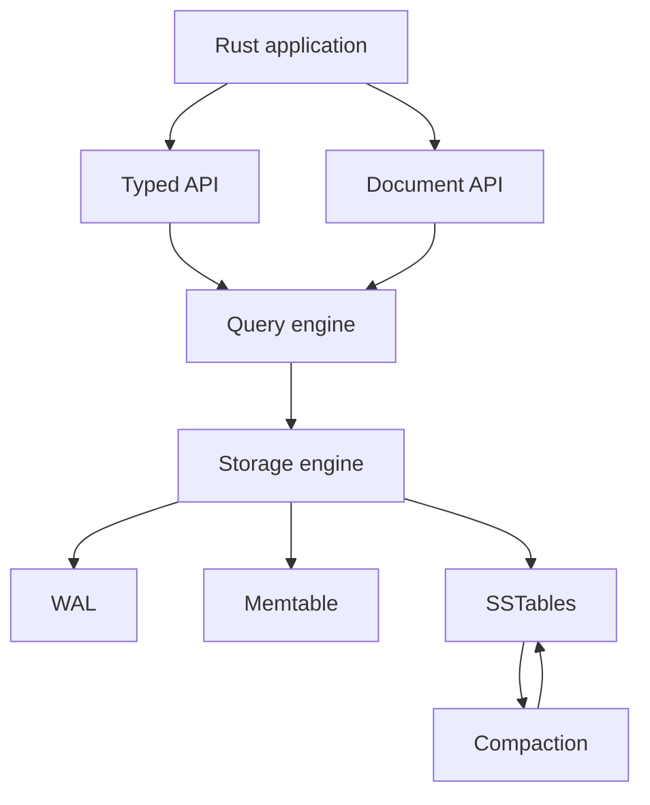

# Architecture

QuokkaDB keeps persistence inside the Rust application that uses it. A typed collection turns Rust models and typed expressions into database operations; a document collection accepts BSON documents and query specifications. Both APIs use the same query and storage layers underneath.

For example, this typed query stays inside the application process from the collection handle to the returned model:

```rust
let plant = db
    .typed_collection::<Plant>("plants")
    .find_one(|plant| plant.needs_water.eq(true))?;
```

## Main layers



The public APIs create collection operations and leave the database to choose how to execute them. The query engine builds and optimizes a plan, choosing an appropriate access path such as a point lookup, index scan, or collection scan. Compatible plans can be reused through the query cache. Filtering, projection, sorting, and limits are then composed around the storage access where needed.

The storage engine owns the database directory. It accepts writes through the write-ahead log and in-memory tables, and moves older data into on-disk sorted tables. Background flushing and compaction organize those files without changing the API used by the application.

## One storage engine

Collections and indexes share a single LSM storage engine. Document records and index entries use the same WAL, memtable, SSTable, flushing, and compaction machinery; QuokkaDB does not maintain a separate persistence subsystem for indexes.

When a write changes a document, the corresponding index entries are updated through the same write path. This lets index maintenance participate in the atomicity of the write. The catalog describes collections and indexes and informs query planning and execution, but it is metadata at the query/storage boundary rather than another storage output alongside the WAL or SSTables.

## How a read works

1. The typed API expresses the query through Rust model fields and serializes its filter values into the database representation. The document API starts with BSON values directly.
2. The query engine builds and optimizes a plan, choosing an appropriate access path such as a point lookup, index scan, or collection scan. Compatible plans can be reused through the query cache.
3. The executor acquires a snapshot and runs the plan. Filtering, projection, sorting, and limiting can be composed around the storage access.
4. Results are returned as BSON documents or deserialized back into the requested Rust type.

Records are versioned by sequence number. A read uses a snapshot sequence number to select the versions visible at query start, providing multi-version concurrency control while concurrent writes continue. The snapshot remains active while the result iterator is consumed, so later writes do not change that query's view.

Read [Concepts](concepts.md#queries-updates-and-indexes) for query semantics and [Features](features.md#querying) for the supported query surface.

## How a write works

Insert, update, replace, and delete operations also become plans, but they are executed as writes rather than cached read iterators. Updates and deletes read the matching documents, calculate their changes, and prepare a write batch. Concurrent changes are checked before the batch is committed.

The storage engine appends the batch to the write-ahead log, assigns sequence numbers, and makes the new records visible through the current in-memory table. A write operation commits as a whole or returns an error without applying a partial result. The configured `WalDurability` controls when the recovery record is considered durable; `sync()` can require durability for one operation.

As the in-memory table grows, QuokkaDB rotates it and schedules a flush to an on-disk sorted table. Compaction later merges files and removes obsolete versions when active snapshots no longer need them. These maintenance tasks are separate from the query and write APIs.

See [Concepts — Concurrent access and atomic writes](concepts.md#concurrent-access-and-atomic-writes), [Concepts — Durability and recovery](concepts.md#durability-and-recovery), and [Operations](operations.md) for the user-visible guarantees.

## Opening and recovery

`QuokkaDB::open` opens the application-owned database directory and restores the database state. If the application or process stops unexpectedly, reopening the same directory replays the available recovery records according to the selected durability mode.

QuokkaDB is embedded and has no database server or network protocol. The documented sharing model is to clone one opened `QuokkaDB` handle across threads in the same process. Keep the directory owned by that application process while it is running; see [Operations — Own the database directory](operations.md#own-the-database-directory).

See [Features](features.md#not-supported) for the current unsupported surface and [Project](project.md#current-development-stage) for compatibility and stability expectations.
